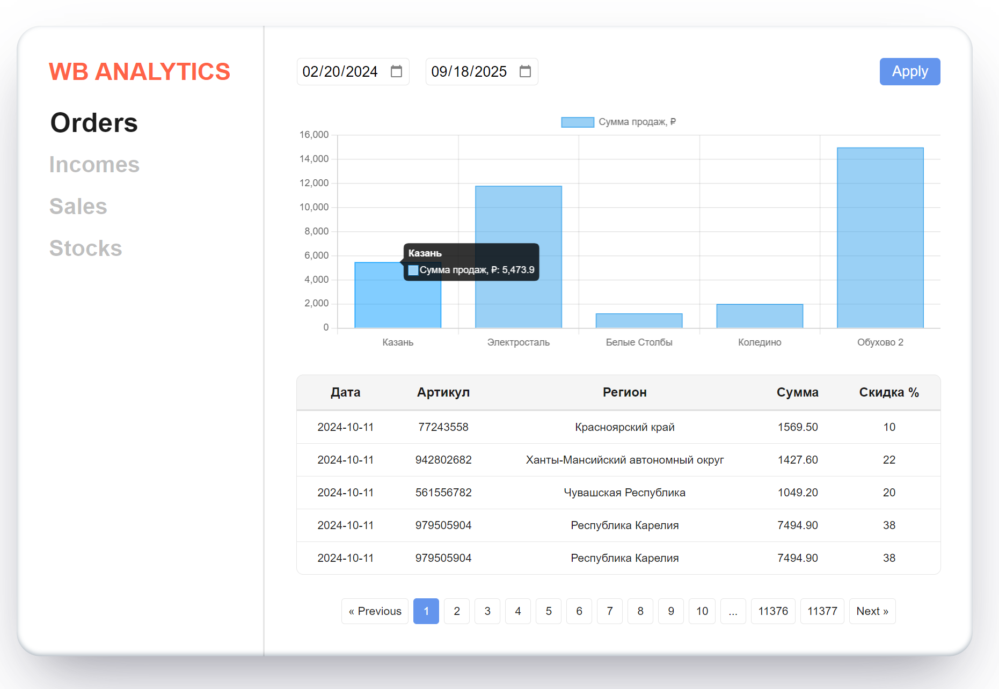

# Интерфейс аналитики WB
Интерфейс позволяет просматривать и анализировать данные, полученные из API, по четырём разделам: incomes, orders, sales и stocks. Данные загружаются за указанные даты и отображаются в виде таблиц с фильтрацией и постраничной пагинацией. Для наглядности ключевые показатели визуализируются в интерактивных графиках.



> ### ⚠️Ограничения API
> - API доступен только по **HTTP**, хостинги работает через **HTTPS** → возникает ошибка **Mixed Content**. 
> - На сервере не открыт **CORS**, прямые запросы невозможны.
>
>Для запуска локально: указать в api.ts → baseURL: '/api' в vite.config.ts настроен proxy который перенаправит запросы на http://109.73.206.144:6969

## Начало работы

1. Установите `node.js` Поддерживаемая версия сборки `20+`
2. Установите зависимости с помощью

```shell
npm ci
```

3. Запустите проект с помощью

```shell
npm run dev
```
